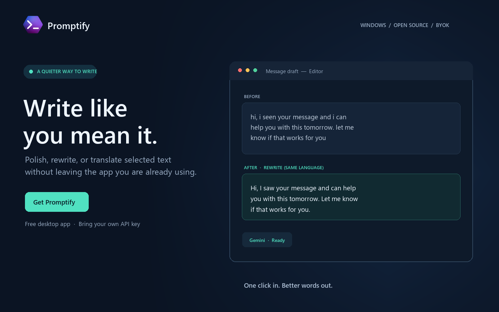
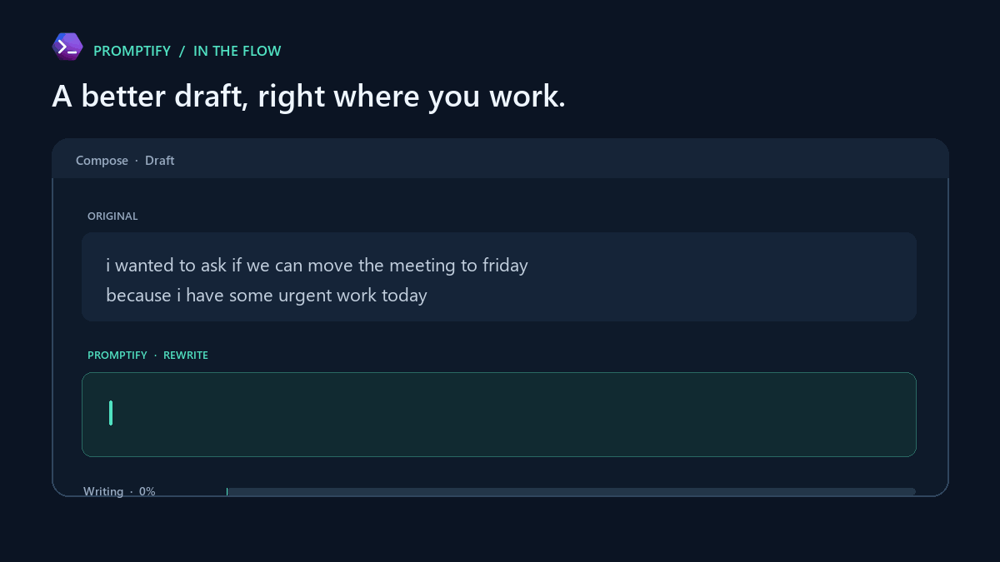

# Promptify



<p align="center">
  <strong>Better words, right where you work.</strong><br>
  A free, open-source Windows writing assistant for quick rewrites, Roman Urdu polish, and translation.
</p>

<p align="center">
  <a href="https://github.com/mrhidden313/Promptify/raw/refs/heads/main/downloads/Promptify.exe?download=1"><strong>⬇ Download Promptify for Windows</strong></a>
</p>

<p align="center">
  <a href="LICENSE"></a>
  
  
</p>

<p align="center">
  
</p>

## What it does

Promptify sits quietly above your other apps. Select text, choose a writing action, and send the result back to the original field without copy/pasting between separate AI websites.

- **Rewrite in place** while preserving the original language and meaning.
- **Polish Roman Urdu** while keeping it in Latin script.
- **Translate and enhance** into natural English.
- **Choose your AI provider** and bring your own API key.
- **Optional failover** to another provider whose key you added.
- **Default-on word typing** with a one-paste option in Settings.
- **Copyable error alerts** with credentials redacted from diagnostics.
- **Windows DPAPI credential storage** tied to the current Windows account.

## Get started

### Portable app

1. **[Download Promptify.exe](https://github.com/mrhidden313/Promptify/raw/refs/heads/main/downloads/Promptify.exe?download=1)** directly from this repository.
2. Run it on Windows. Python is not required on the target PC.
3. Open **Settings** from the floating Promptify mark or system tray.
4. Choose a primary provider and enter your own API key. Add other keys only if you want failover.
5. Select text in an app, click Promptify, and choose an action.

### Run from source

Requires Windows, Python 3.14+, and a provider API key for actual generation.

```powershell
git clone https://github.com/mrhidden313/Promptify.git
cd Promptify
python -m pip install -r requirements.txt
python main.py
```

### Build a portable release

```powershell
python -m pip install pyinstaller
.\build_release.ps1
```

The result is `release\Promptify.exe`. The release bundles Python, dependencies, the app icon, and Tcl/Tk resources.

## Provider setup

Promptify does not ship with API keys. Each user supplies their own provider credentials; a key is sent only to that provider’s endpoint. Keys are encrypted with Windows DPAPI in local settings and are not portable to another Windows account/device.

| Provider | Create or manage a key | Default model |
| --- | --- | --- |
| Gemini | [Google AI Studio](https://aistudio.google.com/apikey) | `gemini-3.5-flash-lite` |
| OpenAI | [OpenAI API keys](https://platform.openai.com/api-keys) | `gpt-4o-mini` |
| Groq | [Groq Console](https://console.groq.com/keys) | `llama-3.1-8b-instant` |
| DeepSeek | [DeepSeek Platform](https://platform.deepseek.com/api_keys) | `deepseek-chat` |
| xAI | [xAI Console](https://console.x.ai/) | `grok-3-mini` |

Provider pricing, free quotas, and availability are controlled by each provider and can change. Promptify itself has no subscription or hosted account requirement.

### Fallback and privacy

The selected provider is always tried first. If **Try other configured providers** is enabled and that request fails, Promptify tries the next provider that has its own saved key. The same selected text may therefore be sent to those additional providers. Turn fallback off to keep every request with the primary provider only.

## Preferences

- **Generation → Type the result word by word** is on by default. Turn it off for one atomic paste.
- **Try other configured providers if the primary fails** is on by default and can be disabled.
- Error alerts stay beneath the floating mark until dismissed and include **Copy details**. Copied diagnostics redact configured API keys.
- Settings and log files remain local to the current Windows profile.

## Troubleshooting

Use **Open Logs** from the floating mark or tray menu. The log folder is `%LOCALAPPDATA%\Promptify\logs`. Error alerts can be copied with **Copy details** and shared for diagnosis; API keys are redacted.

- **No provider key**: add a key in Settings for the selected provider or enable a configured fallback.
- **401/403**: check that provider’s key in Settings and verify it is active in its console.
- **429**: provider rate limit or quota; wait or use another configured provider.
- **5xx / temporarily unavailable**: Promptify retries transient errors once, then tries configured fallback providers.
- **Couldn’t copy selected text**: keep the selection, wait briefly, and try again. Some protected/admin fields block simulated keyboard input.
- **Keys cannot be decrypted**: DPAPI keys only decrypt under the Windows account/device that saved them. Re-enter keys in Settings after migrating to another PC/account.

## Developer

Built by **Mr Farman**. [Learn more about the developer](https://fktech.site).

## Contributing

Issues, bug reports, and focused pull requests are welcome. Please do not include API keys, personal text, or private logs in reports. Before submitting, run:

```powershell
python -m py_compile main.py ai_provider.py clipboard_helper.py config.py
python -m pip check
```

## License

Promptify is released under the [MIT License](LICENSE).
